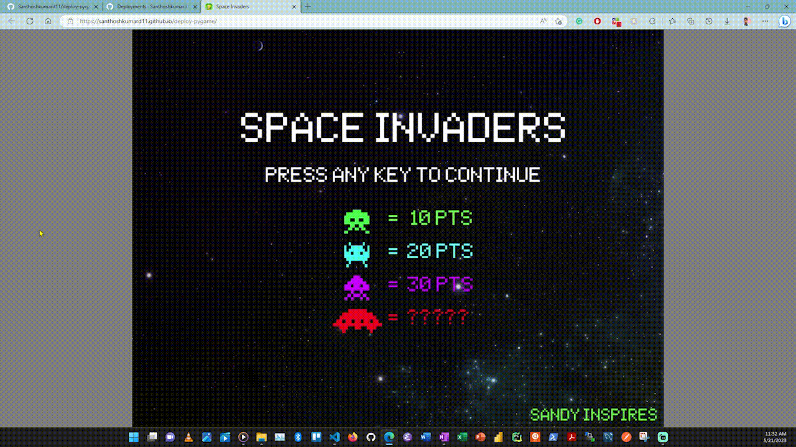

# Common Mistakes

- [source](https://dev.to/sandy_codes_py/deploy-pygames-to-github-pages-with-webassembly-56po)

Sharing some mistakes I did and found the fix the hard way.

1) Setting the Workflow permissions right

for a flow to write to your repo (creating branch or pushing code) you need to enable read and write permissions. Steps: 1) Go to your repo Settings 2) Click on the Actions ** tab on the left-hand side sidebar 3) Click on **General 4) Scroll all the way down to find Workflow permissions, check Read and write permissions and click Save.
2) use $GITHUB_WORKSPACE variable if you're not sure from where you're fetching the files or folders from.

Will add more in the future as I encounter more of them.

# Deploy pygames

Deploy your pygames code to GitHub Pages with just a push

## Gameplay

### PC

### Mobile

## Setup Environment for local

### Create a venv

`python3 -m venv venv`

### Install all Python packages

`pip install -r requirements.txt`

### Run the game

`python3 main.py`

### Web - runs on port localhost:8000

Note: Assuming you've the game in a separate folder

`python3 -m pygbag space_invaders/`
